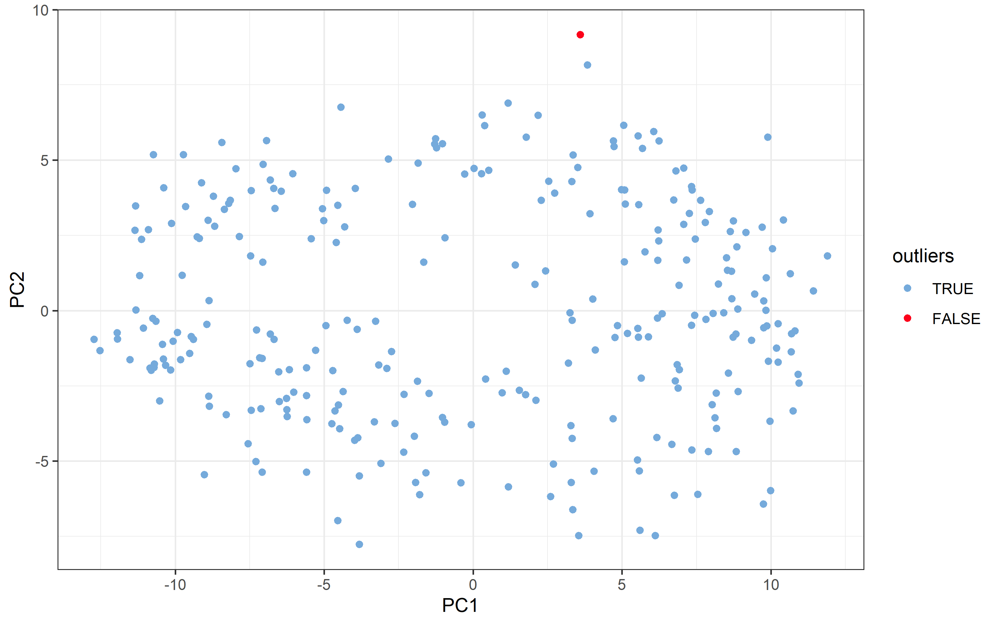
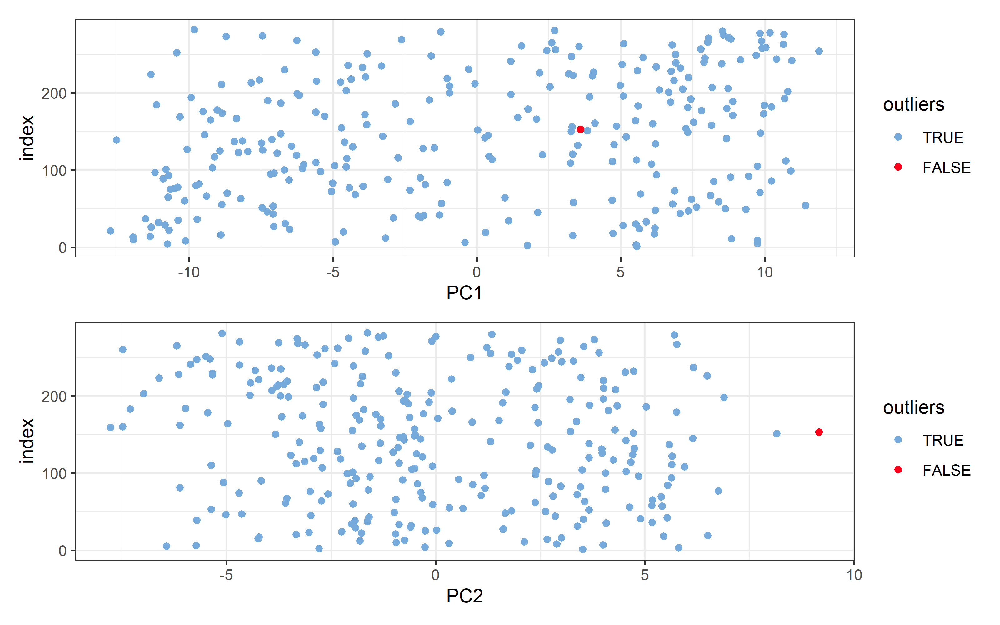
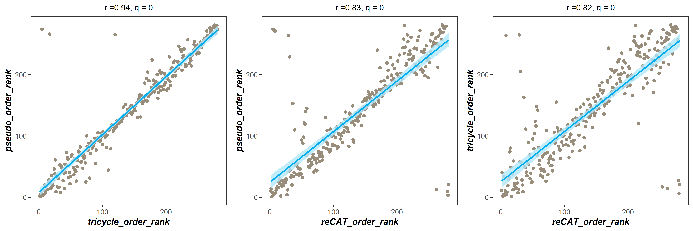

<!-- README.md is generated from README.Rmd. Please edit that file -->


# CAFF

<!-- badges: start -->
<!-- badges: end -->

The goal of CAFF is to do Cell cycle Analysis of scRNA-seq data based on Fourier Filter.

## Installation

You can install the development version of `CAFF` like so:

``` r
# install.packages("devtools")
devtools::install_github("Xu_Feng/CAFF")
```

## Application
CAFF provides a variety of functions to analyze the cell cycle of single cell RNA-seq data in the following five aspects:
- Pseudotime quantification
- Identify the cell cycle-related genes
- Cell cycle phase labels
- Removing the cell cycle effect from the scRNA-seq dataset
- Determining G0 (quiescent) state

## Using the GSE129447(Hela) as an example:
### 1. Quality Control
#### 1.1 Cell and gene screening
- Gene screening: Firstly, the genes whose expression level exceeds 70% are 0 are removed. This percentage can fluctuate between 70-90% according to the quality of the data.
- Cell screening: Cells with sequencing depth less than 10000 were removed by viewing the sequencing depth distribution of the dataset.


```r
## Data preprocessing ------------------------
library(edgeR)
library(tidyverse)
library(CAFF)
library(data.table)

data(Hela1)

# Check the sequencing depth distribution:
quantile(colSums(Hela1), probs = c(0,0.1, 0.25,0.5,0.75,0.9, 1))
#>        0%       10%       25%       50%       75%       90%      100% 
#>    3387.0   63399.3  123737.5  206765.0  338062.8  536640.2 1064414.0

# Cells with sequencing depth less than 10000 were removed:
colids <- which(colSums(Hela1) > 10000)

# Genes with 0 expression in more than 70% of all cells were removed:
rowids <- which(apply(Hela1, 1, function(x) length(which(x == 0))/length(x) <= 0.7))

exp <- Hela1[rowids, colids]
```

#### 1.2 Data Preprocessing
- cpm transformation: For Count data, after quality control, the data is transformed to cpm format using the `cpm` function in the `edgeR` package.
- The expression matrix of cell cycle-related genes was extracted: the cell cycle genes used were 97 genes provided in Seurat package.


```r
# cpm transformation：
exp_cpm <- cpm(exp, log = T) %>% round(2)
exp_cpm_nolog <- cpm(exp, log = F) %>% round(2)

# extracte the expression matrix of cell cycle related genes:
load("cc_genes/cc_genes.Rdata")
cc_genes <- intersect(seurat_cc_genes, rownames(exp_cpm))
data_cc <- exp_cpm[cc_genes,]
```

#### 1.3 PCA was performed on data to observe data distribution and remove outliers


```r
# the pca_plot function to see how the data is distributed on pc1 and pc2:
p_x <- pca_plot(data_cc, time.iqr = 1)
p_x$plot1
```



```r
p_x$plot2
```



```r

# remove_pc_outliers
final_index <- p_x$final_index
data_cc_new <- data_cc[, final_index]
```

### Pseudotime quantification
#### `CAFF` methods

```r
## Our method ==============
pseudo_order_list <- build_pseudo_order(data_cc_new, method = "Default")
#> Error in match.fun(FUN): object 'cart2pol' not found
pseudo_order <- pseudo_order_list$pseudo_order
#> Error in eval(expr, envir, enclos): object 'pseudo_order_list' not found
pseudo_order_rank <- pseudo_order_list$pseudo_order_rank
#> Error in eval(expr, envir, enclos): object 'pseudo_order_list' not found
```

#### `Tricycle` method

```r
## tricycle method ==============
tricycle_order_rank <- build_pseudo_order(data_cc_new, method = "tricycle")
#> 载入需要的程辑包：SingleCellExperiment
#> 载入需要的程辑包：SummarizedExperiment
#> 载入需要的程辑包：MatrixGenerics
#> 载入需要的程辑包：matrixStats
#> 
#> 载入程辑包：'matrixStats'
#> The following object is masked from 'package:dplyr':
#> 
#>     count
#> 
#> 载入程辑包：'MatrixGenerics'
#> The following objects are masked from 'package:matrixStats':
#> 
#>     colAlls, colAnyNAs, colAnys, colAvgsPerRowSet, colCollapse,
#>     colCounts, colCummaxs, colCummins, colCumprods, colCumsums,
#>     colDiffs, colIQRDiffs, colIQRs, colLogSumExps, colMadDiffs,
#>     colMads, colMaxs, colMeans2, colMedians, colMins,
#>     colOrderStats, colProds, colQuantiles, colRanges, colRanks,
#>     colSdDiffs, colSds, colSums2, colTabulates, colVarDiffs,
#>     colVars, colWeightedMads, colWeightedMeans,
#>     colWeightedMedians, colWeightedSds, colWeightedVars, rowAlls,
#>     rowAnyNAs, rowAnys, rowAvgsPerColSet, rowCollapse, rowCounts,
#>     rowCummaxs, rowCummins, rowCumprods, rowCumsums, rowDiffs,
#>     rowIQRDiffs, rowIQRs, rowLogSumExps, rowMadDiffs, rowMads,
#>     rowMaxs, rowMeans2, rowMedians, rowMins, rowOrderStats,
#>     rowProds, rowQuantiles, rowRanges, rowRanks, rowSdDiffs,
#>     rowSds, rowSums2, rowTabulates, rowVarDiffs, rowVars,
#>     rowWeightedMads, rowWeightedMeans, rowWeightedMedians,
#>     rowWeightedSds, rowWeightedVars
#> 载入需要的程辑包：GenomicRanges
#> 载入需要的程辑包：stats4
#> 载入需要的程辑包：BiocGenerics
#> 
#> 载入程辑包：'BiocGenerics'
#> The following objects are masked from 'package:dplyr':
#> 
#>     combine, intersect, setdiff, union
#> The following object is masked from 'package:limma':
#> 
#>     plotMA
#> The following objects are masked from 'package:stats':
#> 
#>     IQR, mad, sd, var, xtabs
#> The following objects are masked from 'package:base':
#> 
#>     anyDuplicated, append, as.data.frame, basename, cbind,
#>     colnames, dirname, do.call, duplicated, eval, evalq, Filter,
#>     Find, get, grep, grepl, intersect, is.unsorted, lapply, Map,
#>     mapply, match, mget, order, paste, pmax, pmax.int, pmin,
#>     pmin.int, Position, rank, rbind, Reduce, rownames, sapply,
#>     setdiff, sort, table, tapply, union, unique, unsplit,
#>     which.max, which.min
#> 载入需要的程辑包：S4Vectors
#> 
#> 载入程辑包：'S4Vectors'
#> The following objects are masked from 'package:data.table':
#> 
#>     first, second
#> The following objects are masked from 'package:dplyr':
#> 
#>     first, rename
#> The following object is masked from 'package:tidyr':
#> 
#>     expand
#> The following objects are masked from 'package:base':
#> 
#>     expand.grid, I, unname
#> 载入需要的程辑包：IRanges
#> 
#> 载入程辑包：'IRanges'
#> The following object is masked from 'package:data.table':
#> 
#>     shift
#> The following objects are masked from 'package:dplyr':
#> 
#>     collapse, desc, slice
#> The following object is masked from 'package:purrr':
#> 
#>     reduce
#> The following object is masked from 'package:grDevices':
#> 
#>     windows
#> 载入需要的程辑包：GenomeInfoDb
#> 载入需要的程辑包：Biobase
#> Welcome to Bioconductor
#> 
#>     Vignettes contain introductory material; view with
#>     'browseVignettes()'. To cite Bioconductor, see
#>     'citation("Biobase")', and for packages
#>     'citation("pkgname")'.
#> 
#> 载入程辑包：'Biobase'
#> The following object is masked from 'package:MatrixGenerics':
#> 
#>     rowMedians
#> The following objects are masked from 'package:matrixStats':
#> 
#>     anyMissing, rowMedians
#> 
#> 载入程辑包：'SingleCellExperiment'
#> The following object is masked from 'package:edgeR':
#> 
#>     cpm
#> No custom reference projection matrix provided. The ref learned from mouse Neuroshpere data will be used.
#> The number of projection genes found in the new data is 59.
```

#### `reCAT` method

```r
## reCAT method ==============
data_cc_cyclebase <-exp_cpm[intersect(cyclebase3.0_genes,rownames(exp_cpm)),intersect(colnames(data_cc_new),colnames(exp_cpm))]
dim(data_cc_cyclebase)
#> [1] 303 281


reCAT_order <- build_pseudo_order(data_cc_cyclebase, method ='reCAT')
#> 载入需要的程辑包：doParallel
#> 载入需要的程辑包：foreach
#> 
#> 载入程辑包：'foreach'
#> The following objects are masked from 'package:purrr':
#> 
#>     accumulate, when
#> 载入需要的程辑包：iterators
#> 载入需要的程辑包：parallel
#> 载入需要的程辑包：mclust
#>                    __           __ 
#>    ____ ___  _____/ /_  _______/ /_
#>   / __ `__ \/ ___/ / / / / ___/ __/
#>  / / / / / / /__/ / /_/ (__  ) /_  
#> /_/ /_/ /_/\___/_/\__,_/____/\__/   version 5.4.10
#> Type 'citation("mclust")' for citing this R package in publications.
#> 
#> 载入程辑包：'mclust'
#> The following object is masked from 'package:purrr':
#> 
#>     map
#> fitting ...
#> 
  |                                                                      
  |                                                                |   0%
  |                                                                      
  |=========                                                       |  14%
  |                                                                      
  |==================                                              |  29%
  |                                                                      
  |===========================                                     |  43%
  |                                                                      
  |=====================================                           |  57%
  |                                                                      
  |==============================================                  |  71%
  |                                                                      
  |=======================================================         |  86%
  |                                                                      
  |================================================================| 100%
#> 载入需要的程辑包：TSP
#> fitting ...
#> 
  |                                                                      
  |                                                                |   0%
  |                                                                      
  |=========                                                       |  14%
  |                                                                      
  |==================                                              |  29%
  |                                                                      
  |===========================                                     |  43%
  |                                                                      
  |=====================================                           |  57%
  |                                                                      
  |==============================================                  |  71%
  |                                                                      
  |=======================================================         |  86%
  |                                                                      
  |================================================================| 100%
#> fitting ...
#> 
  |                                                                      
  |                                                                |   0%
  |                                                                      
  |=========                                                       |  14%
  |                                                                      
  |==================                                              |  29%
  |                                                                      
  |===========================                                     |  43%
  |                                                                      
  |=====================================                           |  57%
  |                                                                      
  |==============================================                  |  71%
  |                                                                      
  |=======================================================         |  86%
  |                                                                      
  |================================================================| 100%
#> fitting ...
#> 
  |                                                                      
  |                                                                |   0%
  |                                                                      
  |=========                                                       |  14%
  |                                                                      
  |==================                                              |  29%
  |                                                                      
  |===========================                                     |  43%
  |                                                                      
  |=====================================                           |  57%
  |                                                                      
  |==============================================                  |  71%
  |                                                                      
  |=======================================================         |  86%
  |                                                                      
  |================================================================| 100%
#> [1] "make cluster"
#> [1] "register cluster"
#> [1] "finished"
reCAT_order_rank <- reCAT_order[[2]]
```

#### Comparison between the three methods

```r
## Comparison between the three methods ==============
rank_data <- data.frame(pseudo_order_rank = pseudo_order_rank,
                         tricycle_order_rank = tricycle_order_rank,
                         reCAT_order_rank = reCAT_order_rank)
#> Error in data.frame(pseudo_order_rank = pseudo_order_rank, tricycle_order_rank = tricycle_order_rank, : object 'pseudo_order_rank' not found
rank_data <- rank_data[order(rank_data$pseudo_order_rank),]
data_cc_ordered <- data_cc_new[, pseudo_order]

p_list <- cor_scatter_plot(rank_data)
#> 载入需要的程辑包：lattice
#> 载入需要的程辑包：survival
#> 载入需要的程辑包：Formula
#> 
#> 载入程辑包：'Hmisc'
#> The following object is masked from 'package:Biobase':
#> 
#>     contents
#> The following objects are masked from 'package:dplyr':
#> 
#>     src, summarize
#> The following objects are masked from 'package:base':
#> 
#>     format.pval, units

library(cowplot)
p <- plot_grid(plotlist = p_list, ncol = 3)
p
```




